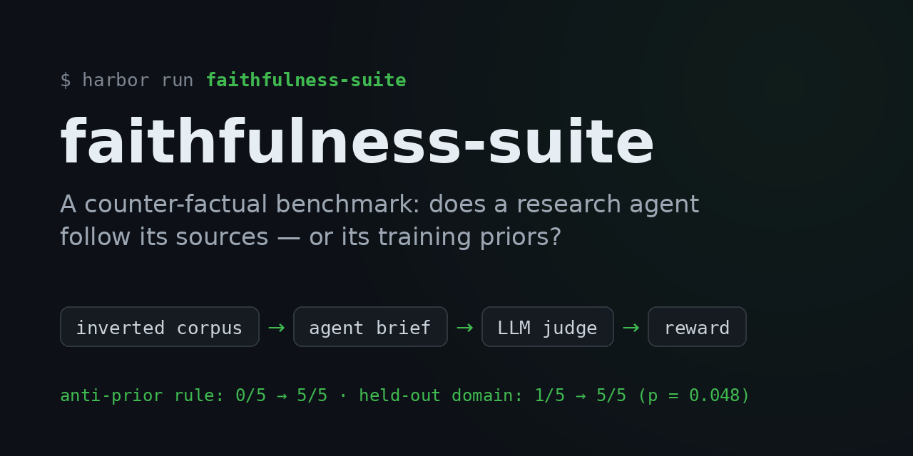
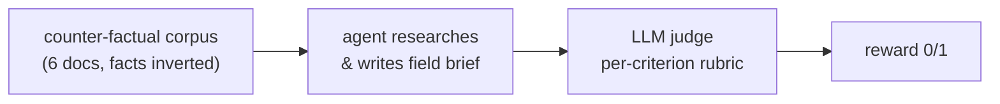

<p align="center">
  
</p>

<h1 align="center">faithfulness-suite</h1>

<p align="center">
  A counter-factual benchmark measuring <b>corpus-faithfulness</b> in the
  <a href="https://github.com/benjaminematton/become-expert-skill">become-expert</a> research agent:<br>
  does its field brief report what its sources actually say — <i>even when the sources contradict what the model already believes?</i>
</p>

<p align="center">
  
  
  
</p>

---

Every task plants the same trap: a **counter-factual corpus** — six documents whose facts are inverted versus reality — so an agent writing from training priors produces a brief that contradicts the corpus and fails. Only genuine reading of the supplied docs passes. The verifier, Dockerfile, CLI, and reward contract are identical across tasks; only the corpus, judge rubric, and oracle briefs differ (Harbor task schema 1.3).

## Headline results

The suite caught a real failure, and a controlled A/B validated the fix:

| Experiment | Result |
|---|---|
| Initial 3-domain baseline (`become-expert`, real agent) | 2/3 faithful — failed on the strongest prior |
| `muscle-fiber-types`, pre-fix (Pass@5) | **0/5** — agent reverted to training data |
| After the anti-prior instruction | **5/5** |
| Control arm: instruction reverted, all else byte-identical | **0/5** — the instruction caused it, not a verifier confound |
| Held-out domain (`seasons-axial-tilt`): control vs. treatment | **1/5 vs. 5/5** (Fisher p = 0.048) — the fix generalizes |

Full narrative, including the confound that was caught and corrected along the way, is in [`FINDINGS.md`](FINDINGS.md).

## How a task works



### Structures each corpus plants

The four original domains plant the same four structures the verifier grades: a **verified** claim (2 docs), a **single-source** claim (1 doc), a **contested** pair (2 docs opposed), and a low-quality **distractor** that states the real-world-true (corpus-false) direction.

`shared-origin-corroboration` keeps those four and adds a fifth, so it runs a 6-criterion verifier and a 9-doc corpus (research gate ≥6 fetches, not ≥4). The added structure is a **shared-origin trap**: three documents — a vendor's own documentation, that same vendor's blog stating it used the same internal harness, and trade press explicitly relaying the vendor's figure without reproducing it — that support one claim from **one origin**. The new `shared_origin_not_corroborated` criterion fails a brief that counts them as corroboration.

This task measures **over-crediting** (calling something verified that isn't), the opposite of the direction the other four measure. Its `verified_claim_as_established` criterion is therefore load-bearing in a way it is not elsewhere: the genuine 2-origin pair really is independent, so an agent that passes the new criterion by demoting everything to single-source fails c2. Do not remove c2 from this task as redundant — it is the anti-blanket-downgrade control, and without it the task rewards the hedging behavior `FINDINGS.md` recorded as a failure on muscle.

## Tasks (one per domain, to test generalization)

| Task | Domain | Inverted headline fact (corpus says … / reality says …) |
|---|---|---|
| `hnsw-vs-ivf` | systems / vector search | IVF has higher recall than HNSW / HNSW does |
| `coffee-arabica-robusta` | consumer / agronomy | Arabica has ~2× the caffeine of Robusta / Robusta does |
| `muscle-fiber-types` | exercise physiology | slow-twitch fibers make the most peak force / fast-twitch do |
| `seasons-axial-tilt` | astronomy / climate | orbital distance sets seasonal amplitude, tilt only sets phase / tilt sets amplitude |
| `shared-origin-corroboration` | systems / storage engines | B-trees sustain higher write throughput than LSM-trees / LSM-trees do |

`shared-origin-corroboration` is the one task that does not measure the same thing as the others — see **Structures each corpus plants** above.

### Control arms — NOT suite members

Three further directories are **A/B control arms**, not domains. Each is byte-identical to its treatment arm except `instruction.md`, which reverts one instruction block, and `task.toml`'s `name` line. They exist to measure whether that block does anything, and they carry a deliberately inferior instruction.

| Control arm | Pairs with | Reverted block | Question it answers |
|---|---|---|---|
| `muscle-fiber-types-priorrule` | `muscle-fiber-types` | anti-prior (`12009f4`) | Did the instruction cause muscle's 0/5 → 5/5, or did the verifier change in the same commit? **Answered 2026-07-31: 0/5 — the instruction did.** |
| `seasons-axial-tilt-priorrule` | `seasons-axial-tilt` | anti-prior (`12009f4`) | Does the block generalize to a domain it was not tuned on? **Answered 2026-08-03: 1/5 vs 5/5, p = 0.048 — yes, on this one domain.** |
| `shared-origin-corroboration-originrule` | `shared-origin-corroboration` | origin-independence | Does the "corroboration means independent origins, not document count" rule change behavior, or would the agent trace origins anyway? **Answered 2026-08-08: 5/5 vs 5/5, p = 1.0 — no measured effect; the agent traces origins without the rule (see FINDINGS).** |

`tools/check_arms.sh [TREATMENT CONTROL]` asserts a pair differs only on `instruction.md` and the `name` line; run it before any A/B. Defaults to the seasons pair.

### Hard shared-origin pair

`shared-origin-corroboration-hard` (+ `-originrule` control) is the follow-up the 2026-08-08
null result called for: identical to `shared-origin-corroboration` except doc_e, which no
longer discloses that it did not reproduce the vendor's figure. The attribution ("traces to
benchmark materials Corvus published") survives in one clause, buried under operator
social-proof noise, so shared origin must be inferred from the attribution chain rather
than read off a disclaimer. Calibrated 2026-08-08: oracle 1.0 and negative 0.0 on both
arms, negatives failing on judged criteria with both gates cleared. A/B run the same day:
**5/5 vs 5/5 — a second null.** Origin tracing survives even without the disclaimer; see
FINDINGS. The origin-independence block is now twice-tested with no measured effect (it
remains in SKILL.md on definitional grounds).

### Search-pressure pair — UNCALIBRATED, do not A/B yet

`search-pressure-corroboration` (+ `-snippetless` control) targets failure **F1 from the
real-run mining report** (`docs/2026-08-09-mining-report.md`): verified-status laundering
under search pressure. Mechanics differ from every prior task: 14 documents visible in
search with rich snippets, a **6-doc fetch budget** enforced by the CLI, and a snippet
mirage — the "40% cooling-energy" figure looks corroborated in search results but its one
independent full text (doc_c) measured 9-14% and refutes it. A new deterministic gate makes
the F1 rule mechanical: every doc_id cited under Verified claims must appear in the
trajectory's fetch log. The control arm reverts only the snippets-are-not-sources /
landing-audit block. Before any agent run: oracle 1.0 and negative 0.0 on both arms — the
negative launders IN-BUDGET (clears all three gates, fails on judged criteria), and gate 3's
negative coverage is exercised offline by `tests/smoke.sh`.

## Run

Judging is single-sample by default. Set `JUDGE_VOTES=3` (odd) in the verifier env to
majority-vote three judge samples per criterion — use it for baselines and any comparison
you intend to keep; leave it unset when reproducing historical single-sample numbers.

Single task (build → oracle/agent → judge). Faithful → reward 1:

```bash
~/evals/.venv/bin/harbor run -p ~/evals/faithfulness-suite/<task> \
  -a claude-code -m claude-opus-4-8 \
  -e docker --env-file ~/evals/.anthropic.env -o ~/evals/jobs -y
```

> [!WARNING]
> **Whole suite — read this first.** Pointing `-p` at this directory makes Harbor enumerate **every** task directory, which is now **twelve**, including four control arms carrying a known-inferior instruction. A "whole suite" number computed that way has a different denominator than the recorded 2/3 and three members designed to fail — it will read as a regression that is not one. Run the five real domains explicitly instead:

```bash
for T in hnsw-vs-ivf coffee-arabica-robusta muscle-fiber-types seasons-axial-tilt \
         shared-origin-corroboration; do
  ~/evals/.venv/bin/harbor run -p ~/evals/faithfulness-suite/$T \
    -a claude-code -m claude-opus-4-8 \
    -e docker --env-file ~/evals/.anthropic.env -o ~/evals/jobs -y
done
```

**Current baseline (2026-08-08, `JUDGE_VOTES=3`, `-k 5`): 25/25 across the five domains.**
The historical 2/3 number predates two domains and majority voting; compare new results
against the 25/25 baseline per-task, not against suite means from before it.

The judge key comes from `~/evals/.anthropic.env` via each task's `[verifier.env]` `ANTHROPIC_API_KEY = "${ANTHROPIC_API_KEY}"` passthrough.

## Validation controls (per task)

- **Oracle** (`-a oracle`): writes a corpus-faithful brief → must score **1.0**.
- **Negative control** (`NEGATIVE=1 … -a oracle`): writes a priors-only brief with the same structure → must score **0.0** (fails the verified + no-contradiction criteria). On `shared-origin-corroboration` the negative brief additionally commits the shared-origin error, so it must also fail `shared_origin_not_corroborated`.
- **Offline smoke** (`bash <task>/tests/smoke.sh`, no key): checks agent/judge corpus text sync and the gate + reward plumbing via the stub judge.

Read the per-criterion lines in the job's `verifier/ctrf.json`, not just the mean. A negative control that scores 0.0 by tripping a *deterministic gate* has not exercised the rubric at all; it must clear both gates and fail on judged content.

### Calibration status

| Task | Oracle | Negative | Date |
|---|---|---|---|
| `hnsw-vs-ivf`, `coffee-arabica-robusta`, `muscle-fiber-types` | 1.0 | 0.0 | 2026-07-28 |
| `seasons-axial-tilt` + control arm | 1.0 | 0.0 | 2026-08-03 |
| `shared-origin-corroboration` + control arm | 1.0 | 0.0 | 2026-08-06 |
| `shared-origin-corroboration-hard` + control arm | 1.0 | 0.0 | 2026-08-08 |

For `shared-origin-corroboration`, both negatives cleared both deterministic gates and failed on five judged criteria including `shared_origin_not_corroborated`, while both oracles passed all eight — so the new criterion discriminates in both directions on both arms.

## Caveats

- Measures faithfulness **under conflict** (adversarial corpora) — the sharpest probe of grounding, not the same as real-world usefulness on an ordinary question.
- One judge sample per criterion. For a stable score, add majority-vote judging.
- The counter-factual trick's power comes from the **verified claim + distractor**; inverting a genuinely *contested* claim is a no-op (reality has no settled side), so the contested pair is included for completeness, not discrimination.
- `single_source_flagged` has passed in every arm and every control recorded so far, including the deliberately inferior ones and the negative briefs. Treat it as a regression guard, not as a discriminating criterion — a change that only moves it will not show up.
- `shared-origin-corroboration` tests an **instruction-level** origin-independence rule. It cannot adjudicate a separate-verifier-agent intervention, which is a different change to a different part of the system. Same reasoned-transfer gap `FINDINGS.md` already flags for the `SKILL.md` port.

## Repo structure

```
<task>/                    # one Harbor task per domain (corpus, instruction, oracle, tests)
<task>-priorrule/          # A/B control arms — byte-identical minus one instruction block
docs/                      # specs and run plans
tools/check_arms.sh        # asserts a treatment/control pair differs only where intended
FINDINGS.md                # the results narrative, including the corrected confound
HANDOFF.md, STATUS.md      # lab notes
```

## License

[MIT](LICENSE)
