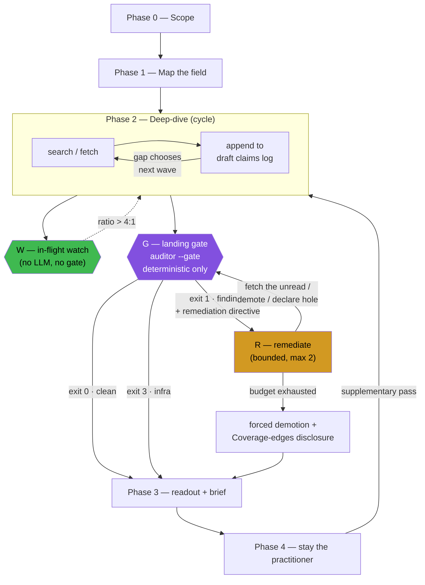

# Design — the landing gate (F4)

**Date:** 2026-08-12 · **Targets:** F1 (verified-status laundering under search pressure), F4 (no leading-indicator guard) · **Status:** proposal, nothing built or run

One-line thesis: `auditor/` already computes everything the gate needs. The change is *when* it runs and *what it blocks* — moving it from post-mortem to a precondition on the Phase 2 → Phase 3 transition. This is the only place in `become-expert` where an explicit topology change is supported by measured evidence.

---

## The graph

Three nodes are new: **W** (a free continuous stat), **G** (the gate), **R** (bounded remediation). Everything else is the existing protocol. Note that Phase 2 stays a cycle whose next wave is chosen by the gap — the gate constrains the *exit*, not the search strategy, which is the one property of this skill that must not be turned into a declared plan.

---

## State the gate reads

All of it already exists in `auditor/`:

| Variable | Source | Currently |
|---|---|---|
| `n_searches`, `n_unique_fetches`, `search_fetch_ratio` | `transcript.stats` | computed, reported as D4 stat only |
| `cited_but_unread` | D1 findings | computed, severity `fail` |
| `shelf_lies` | D2 findings | computed, severity `fail` |
| `single_origin` / relay flags | D3 findings | computed, severity `flag` (judge decides) |

The only new state is `remediation_rounds` (an integer, bounded at 2) and the draft claims log existing **as a file during Phase 2** rather than only in context.

---

## Gate contract

Deterministic checks only. **The gate never calls an LLM** — it must be cheap enough to run on every landing attempt, and a judged gate reintroduces the self-preference risk STATUS.md already flags (judge and agent are both `claude-opus-4-8`).

| ID | Condition | Action |
|---|---|---|
| **G1** | any D1 finding (`verified` claim cites a never-fetched URL) | **block** |
| **G2** | any D2 finding (shelf marks `(read)` on an unfetched URL) | **block** |
| **G3** | any D3 flag on a claim still marked `verified` | **block, resolvable by demotion or by fetching a third origin** |
| **W** | `search_fetch_ratio > 4.0` and `n_searches >= 12` | **directive only, never a block** |

W is deliberately not a gate. `single_source_flagged` is already recorded in FINDINGS as flawed because "it scores honest budget triage as unfaithfulness" — a hard ratio gate would repeat that exact mistake, punishing a run that searched widely and correctly declined to fetch junk. W's job is to fire a directive into the Phase 2 loop ("you are holding N snippets against M reads; either read or stop citing"), which is the leading indicator the mining report found predicted F1 perfectly (11:1 failed, ~1:1 complied).

---

## Remediation and termination

`R` accepts exactly three moves per finding, and MAST's data is the reason the bound is written down rather than implied — unaware-of-termination-conditions is 12.4% of observed multi-agent failures and step repetition another 15.7%, so roughly a quarter of failures are loop hygiene:

1. **Fetch** the cited-but-unread URL, then re-run G.
2. **Demote** the claim to `single-source` (or `search-level`) and drop the citation.
3. **Declare the hole** — remove the claim, note the gap in Coverage edges.

`remediation_rounds` is capped at 2. On exhaustion the run does *not* keep looping: it takes move 2 or 3 automatically and writes the forced demotion into Coverage edges. This is SKILL.md's existing rule 4 ("an honest hole beats a fabricated read") promoted from prose to a mechanical fallback.

Exit 3 (infra) passes through to Phase 3 unblocked and annotated. A gate that can't run is not a verdict — that contract is already in `audit.py` and should be preserved verbatim.

---

## The gate's known weakness: demote-to-pass

G1–G3 are all satisfiable by demoting every claim to `single-source`. That is the blanket-downgrade failure the suite already defends against with `verified_claim_as_established` (c2), and the seasons control arm's failures were *entirely* on that axis — 0 leaks, 4 hedges. A deterministic gate cannot tell an honest demotion from a hedge.

Two mitigations, neither complete:

- The gate emits `demotions_under_pressure` (claims whose status changed after a gate finding) as a **reported stat**, so the eval can see hedging even though the gate can't block it.
- SKILL.md wording must state explicitly that demoting to clear the gate, when a second origin is reachable within budget, is itself a contract violation.

The real counterweight stays where it already is: c2 in the rubric. **Any eval arm for this gate must keep c2 scored**, for exactly the reason the README gives for `shared-origin-corroboration`.

---

## Code changes — as built (2026-08-12)

Step 1 held: `parse_brief` accepted a claims-log-only draft with **no change** (4 claims and
2 shelf entries off a bare table plus a `## Source shelf` heading), so the input artifact
is right and nothing downstream needed redesigning.

Two things came out different from the sketch above.

**Ownership moved.** The gate is *runtime* code — it fires during a real research session,
not during an eval — so shipping it from inside the harness would mean the thing under test
ships from inside the thing that tests it, and anyone installing the skill would get no
gate. The deterministic core (`urlnorm`, `transcript`, `brief`, `checks`, `gate`,
`gate_cli`) now lives in `become-expert-skill/scripts/auditor/` and this repo **vendors** it
via `tools/sync_gate_core.sh`, one level up from the existing `sync_auditor.sh`
(skill → suite → live-web task). `judge.py`, `report.py` and `audit.py` are eval-only and
stay owned here; `auditor/tests/test_vendor_drift.py` fails if a vendored file is edited in
place, so the product's runtime cannot silently fork from what this suite grades.
`audit.py` is therefore **unchanged** — the post-hoc auditor's finding set, and the
baselines resting on it, do not move.

**A gap turned up: G4.** The mining report lists three deterministic sub-forms of F1 and
`checks.py` covered two. Single-citation `verified` — the Aug 3 ~$100k/12-week claim —
trips neither D1 (its one source *was* fetched) nor D3 (which needs 2+ read URLs to compare
origins), so it would have walked through the gate as originally specced. G4 blocks a
`verified` claim resting on fewer than two *read* citations, making evidence rule 1
mechanical. It is gate-local by design and deliberately not added to `checks.py`.

Also worth recording: Aug 3's invented `verified (by absence)` does **not** become a D0 row
— `parse_brief` word-matches `verified` inside it, so it parses as plain `verified` and G4
catches it on zero read sources rather than G0. Non-obvious, so it has its own test.

`SKILL.md` changed as planned: Phase 2 now requires the claims log as a file, and Phase 3
runs the gate ahead of the self-audit checklist, with the three legal remediation moves and
a 2-round cap. That swap is the substantive one — the old checklist is the agent auditing
itself, and self-audit is precisely what failed on Aug 3.

**Verified:** skill-side core 85 passed / 0 failed / 1 skipped-unsupported; suite-side
20 passed / 0 failed / 4 skipped-unsupported, both on fresh checkouts. The gate blocks the
Aug-3 *shape* on G1+G2+G3+G4 at 10.8:1 and clears the Aug-8 shape at 1.0:1. The real
fixtures are local-only and **have not been run** — `tools/gate_retro.sh` is the check that
matters and is still outstanding.

---

## How to measure it

This is where the design is most at risk, and the risk is legible in advance.

**The sealed A/B may return null, for a known reason.** `search-pressure-corroboration` was built to reproduce F1 and didn't — both arms fetched the identical six docs and passed the mirage criterion 5/5. If the pressure doesn't reproduce in a sealed 14-doc corpus with a 6-fetch budget, a gate that fires on that pressure has nothing to catch. Budget the sealed arm as a cheap falsification attempt, not as the primary evidence, and pre-register that a null there does **not** condemn the gate.

**Arm construction.** The gate is tooling plus an instruction, not an instruction block, so `tools/check_arms.sh` (asserts arms differ only on `instruction.md` and the `name` line) would fail on a naive build. Fix: **ship the gate binary in `environment/` for both arms**, and let `instruction.md` differ only on whether landing requires a clean gate exit. The guard then still holds, and the measured axis is "does requiring the gate change behavior" — which is the actual question.

**Primary evidence lives in the live channel.** F1 was observed in real sessions, and `live-web-faithfulness` + the local Aug-3-must-fail / Aug-8-must-pass fixtures are the instrument that can see it. The strongest available design is a retro-audit: replay the gate against the Aug 3 transcript and confirm it blocks (it should — three D1 findings and a same-origin D3 are all present in that brief's claims table), then run gate-on vs gate-off on live topics chosen to induce search pressure.

**Pre-register before running.** STATUS.md's own note applies unchanged: `(control 1, treatment 4)` means nothing at n=5, Fisher p = 0.206. Use `JUDGE_VOTES=3`, record per-criterion booleans rather than reward means, and keep `demotions_under_pressure` and `search_fetch_ratio` as reported covariates so a "win" that is actually hedging is visible as hedging.

---

## What this design deliberately does not do

- **No sub-question fan-out.** Parallel workers with isolated contexts cannot do cross-claim corroboration — the claims log's value is that a source found under sub-question D can independently support a claim logged under sub-question A, and summaries returned from isolated contexts have already dropped the URLs and origins. Delegating the *whole* Phase 2 to `deep-research`, which SKILL.md already does, is the correct shape.
- **No framework.** Nothing here needs LangGraph. The "graph" is one boolean precondition on one edge plus a bounded retry — putting a state-machine library under it adds routing logic, state management, and debugging surface without adding a constraint.
- **No declared graph over phases.** Phases 0–4 are already a linear spine with one deliberate cycle inside Phase 2. Drawing it changes nothing.
- **No verifier subagent (yet).** A separate auditor agent with a clean context window is a real idea — it can't be primed by the writer's rationalizations, and it's a read-heavy, non-constraining subtask, the class where isolation genuinely pays. But it's a bigger change to a different part of the system, and the README already notes the suite can't adjudicate a separate-verifier intervention. Build the gate first; the gate is also the natural place a verifier subagent would later be mounted.

---

## Build order

1. Confirm `parse_brief` accepts a claims-log-only draft file. *(Free. If it fails, stop and redesign the input artifact.)*
2. Add `--gate` to `audit.py`; unit-test G1–G3 against the existing fixtures.
3. Retro-run the gate on the Aug 3 transcript — it must block; and on Aug 8 — it must pass. *(This is the cheapest real signal available and it uses fixtures that already exist.)*
4. Amend `SKILL.md` Phase 2 (log as file) and Phase 3 (gate replaces self-audit).
5. Build the sealed A/B arms with the gate in `environment/` for both; run `tools/check_arms.sh`.
6. Calibrate (oracle 1.0, negative 0.0, negatives clearing deterministic gates and failing on judged criteria), then measure with `JUDGE_VOTES=3`, `-k 5`, against a pre-registered table.

Steps 1–3 are the whole hypothesis test at near-zero cost. If the gate doesn't block the Aug 3 brief, nothing downstream is worth building.
